<table width="100%" border=>
<tr><td colspan=2></td></tr>
<tr><td colspan=2><h1>EXERCISE 09 - Bring your own model</h1></td></tr>
<tr><td><h3>SAP Partner Workshop</h3></td><td><h1> &nbsp;60 min</h1></td></tr>
</table>

## Description
In this exercise you get to experience how easy it is to deploy your machine learning models using SAP Leonardo Machine Learning Foundation services. You will learn how to use the SAP ML Endpoints provided in your service key, that you created for your ML Foundation Service instance.

If you have multiple models for the same application you can also upload and choose which version you wish to serve.
>Note: you can not deploy more than one model with the same name.

Afterwards you will deploy your own Cloud Foundry Python app consuming the deployed model to perform inference queries - a so called inference app. For convenience reason we prepared a simple SAPUI5 app for you in order to test your deployed model calling the deployed inference app.


Exercise Description

- SAP Leonardo ML Foundation BYOM service consumption
-	Login to SAP Cloud Platform - Cloud Foundry environment
-	Create BYOM Service Instance and Service Key (already done in previous exercise)
-	Upload model to ML Foundation Model Repository
-	Deploy your uploaded model
-	Adjust and deploy your prepared inference app (written in Python) to your Cloud Foundry space
-	Test your new model via prepared SAPUI5 application deployed to your Cloud Foundry space


## Target group

* Developers
* People interested in SAP Leonardo and Machine Learning


## Goal

The goal of this exercise is to understand how to deploy your own ML model using the SAP Leonardo ML Foundation Services and test the deployed model.


## Prerequisites

Here below are prerequisites for this exercise.

* You must have completed previous exercises
* The [mnist.zip](files/mnist.zip?raw=true)
* A folder with the unzipped inference app [inference\_app.zip](files/inference_app.zip?raw=true)
* A folder with the unzipped test image files [test\_images\_byom.zip](files/test_images_byom.zip?raw=true)


## Steps

1. [Upload and deploy your model](#upload-deploy-model)
1. [Test your new Model](#test-model)


### <a name="upload-deploy-model"></a> Upload and deploy your model
In this section, you will take a prepared Tensorflow model and upload it to the ML Foundation model repository. After uploading, you will deploy it which will take a few minutes as the docker containers are instantiated for this model.

1.	Navigate in the SCP Cloud Foundry Cockpit to your **Service Key**. Select the **Model Repo URL** and copy it  
	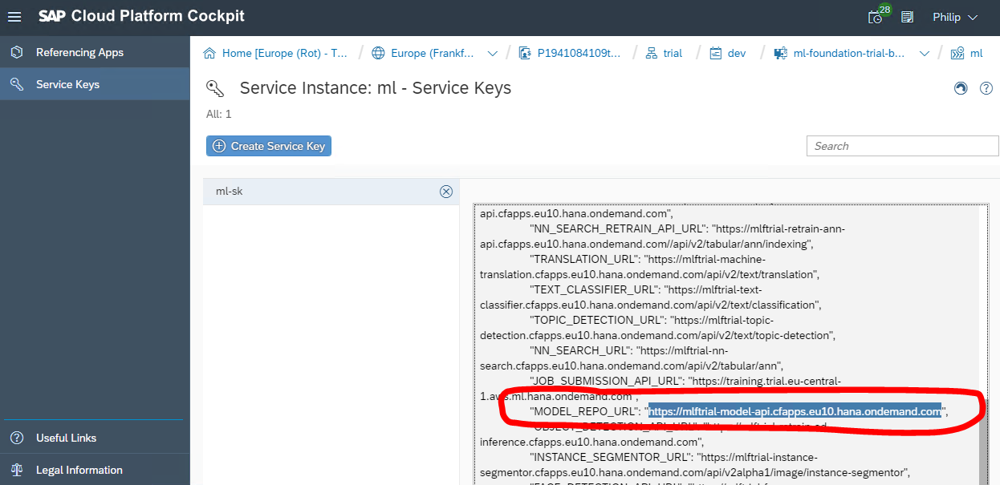

1.	Open a new browser window and paste the copied URL. A Swagger UI is opened up  
	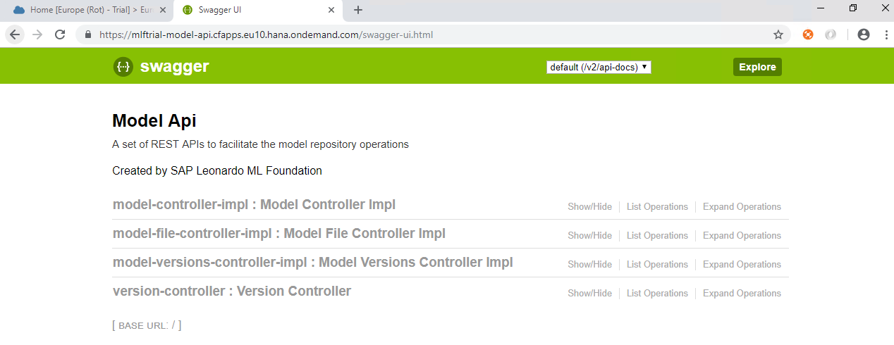

1.	Open the branch **model-versions-controller-impl** and select the **POST** request  	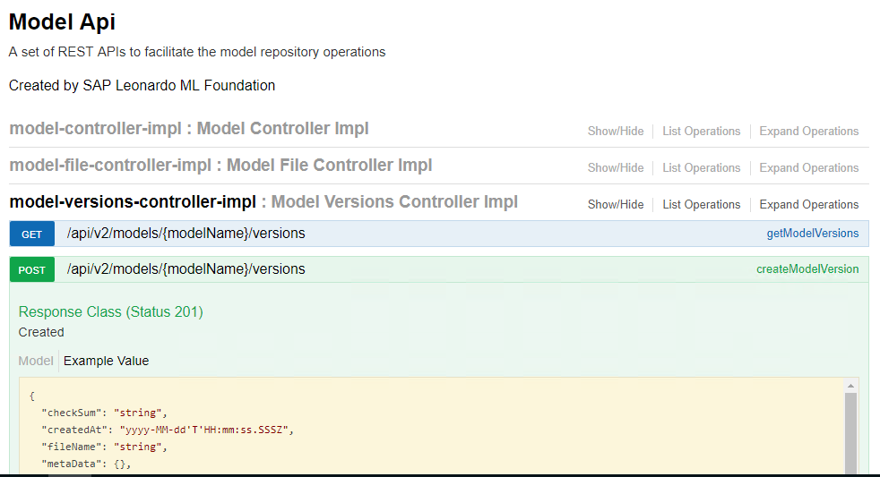

1.	This UI provides the function to upload your own model. Enter the following parameters:

	| Parameter | Value |
	| --------- | ----- |
	| modelName | enter a name of your choice, for example **byom-mnist** |
	| File | select the [mnist.zip](files/mnist.zip?raw=true) file you have downloaded in the prerequisites |
	| Authorization | enter your access token prefixed by **Bearer** and a space |  
  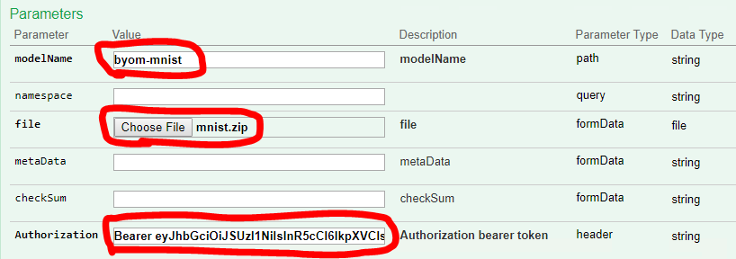

1. Scroll down and click on **Try it out!** to upload your model  	
  

1. While the file is getting uploaded to the server, you will get a small progress bar on the right side at the bottom of the screen  
	

1. At the end of the process, which could also take a few minutes, you should get a **Response Code** of **201**. In the Response Body you should get an answer like the one in the screenshot where you can read the **modelName** and the **version**. Write these down as you will need them in the next steps when we will deploy the model to the ML Foundation model repository
	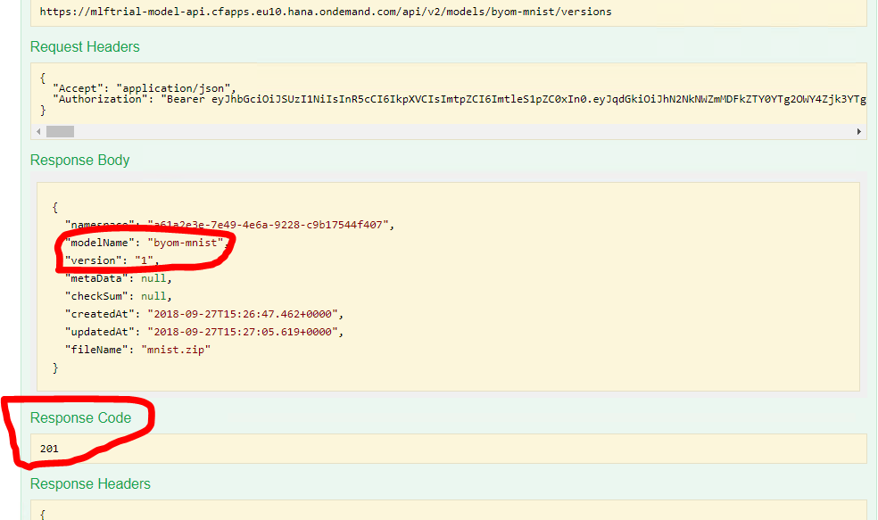

1. Navigate in the SCP Cloud Foundry Cockpit to your Service Key. Select the **DEPLOYMENT\_API\_URL** and copy it in the clipboard	 
	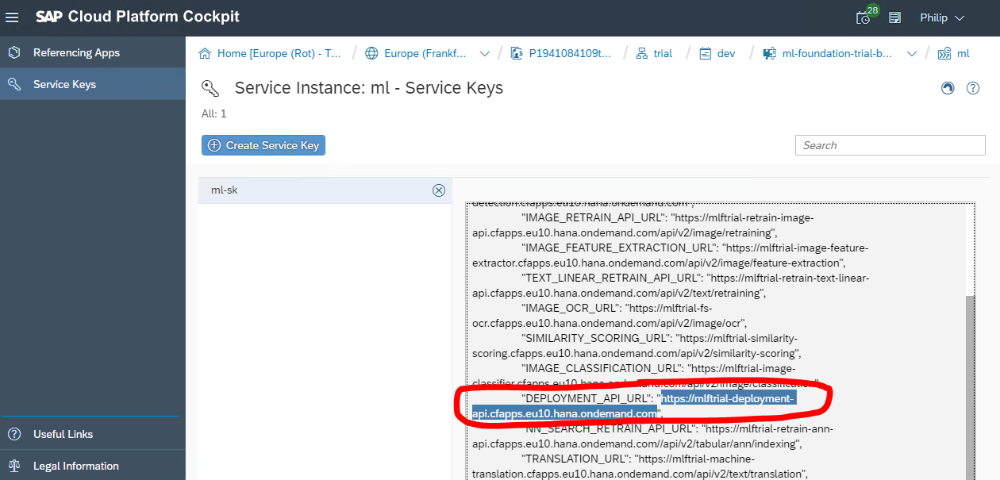

1. Open a new browser window and paste there the copied Deployment API URL. A Swagger UI is opened up  
	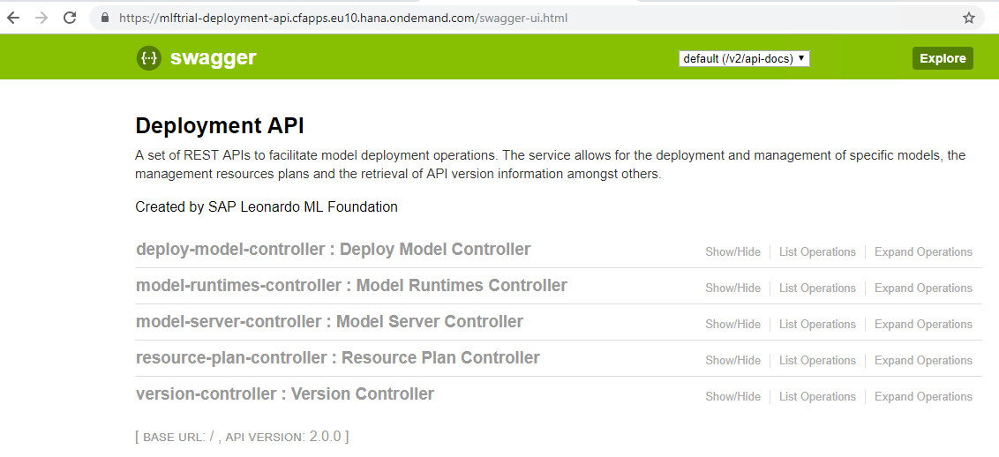

1. It's only possible to have a single model deployed with a trial account and we already have the retrained image model. So before we can deploy the MNIST model we need to delete our retrained brands model. Select the **model-server-controller - GET** method *Find Model Servers*
	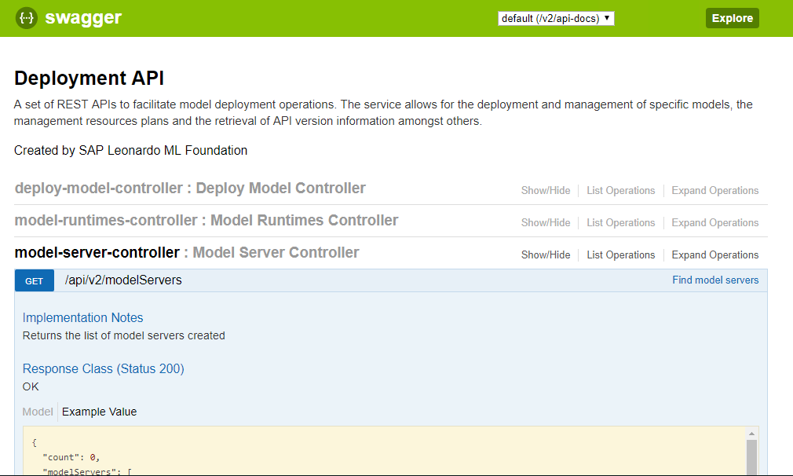

1. Paste your access token as previously into the **Authorization** field and click **Try it out!**. The **Response Body** should display *modelServers* information. Copy the **id** value for your existing model server
 	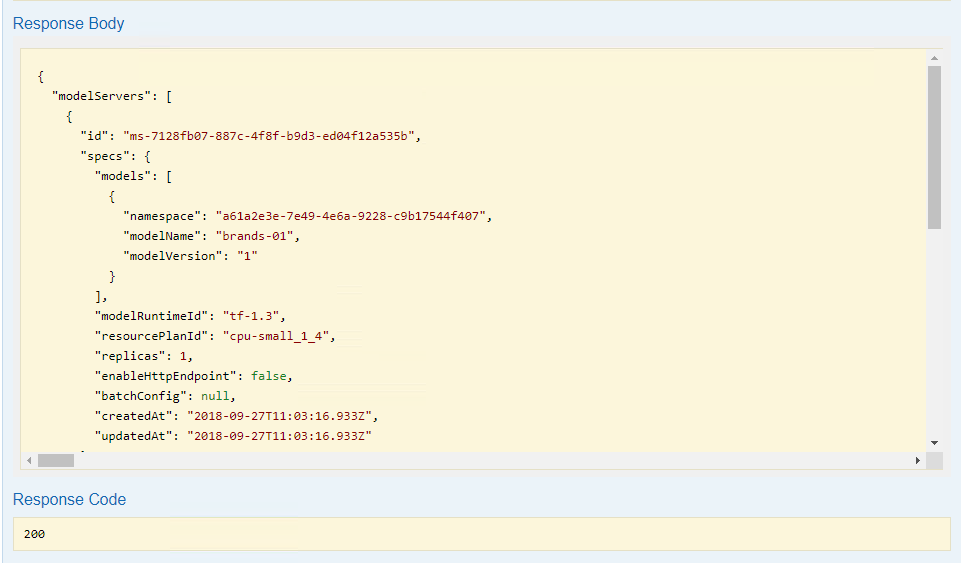

1. Select the **model-server-controller - DELETE** method, paste the **id**, paste your access token as previously into the **Authorization** field, and click **Try it out!**.  
	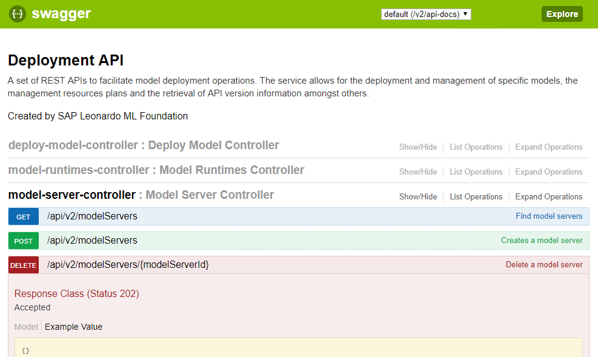

	

1. You should receive the **Response Code** value 202.  
	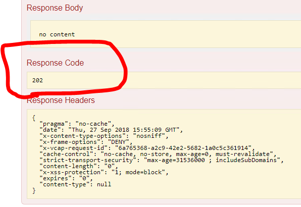

1. Select the **model-server-controller - POST** method  
	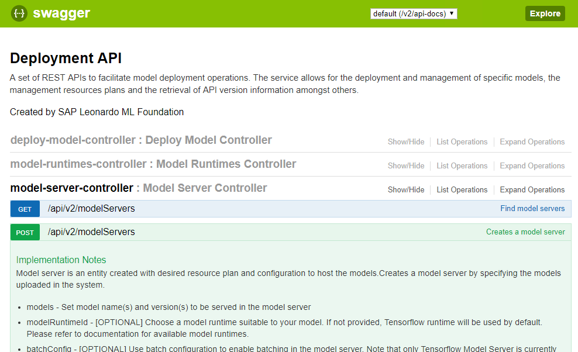

1. This UI provides the function to deploy the model you have uploaded previously. Enter the modelServerSpecsRequest parameter as follows

	```json
	{
	  "specs": {
	    "enableHttpEndpoint": false,
	    "modelRuntimeId": "tf-1.3",
	    "models": [
	      {
	        "modelName": "%MODELNAME%",
	        "modelVersion": "%MODELVERSION%"
	      }
	    ],
	    "replicas": 1,
	    "resourcePlanId": "cpu-small_1_4"
	  }
	}
	```
	where you have to replace the variable **%MODELNAME%** with your model name and **%MODELVERSION%** with your model version. You retrieved this information in the previous step. Paste your access token as previously into the **Authorization** field. When done, click on **Try it out!** to deploy your model  	
	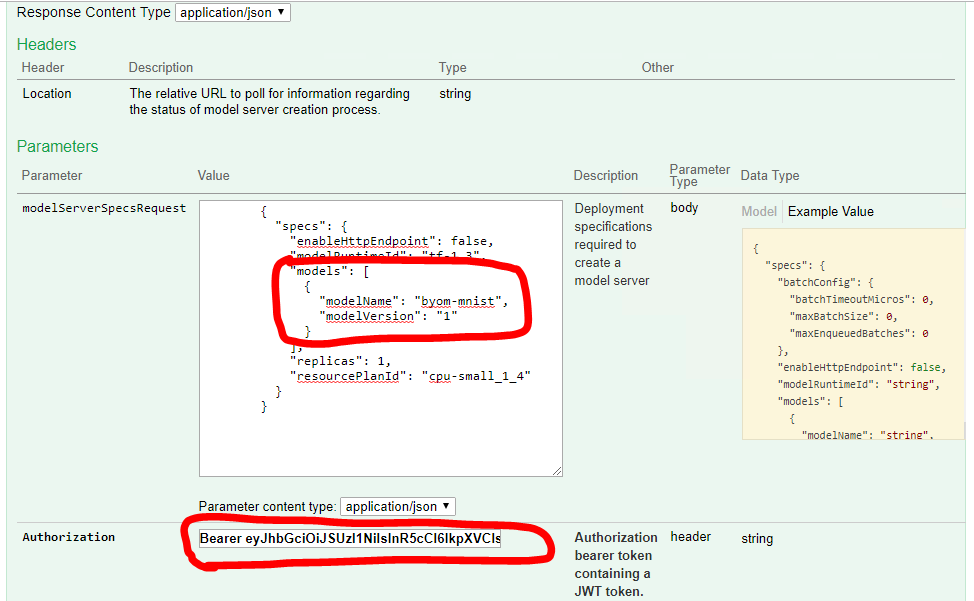

1. You will get a Response Body similar to the one in the screenshot. The status will be **PENDING** at the beginning and the Response Code will be **202**. Copy the **id** at the beginning of the response body  
	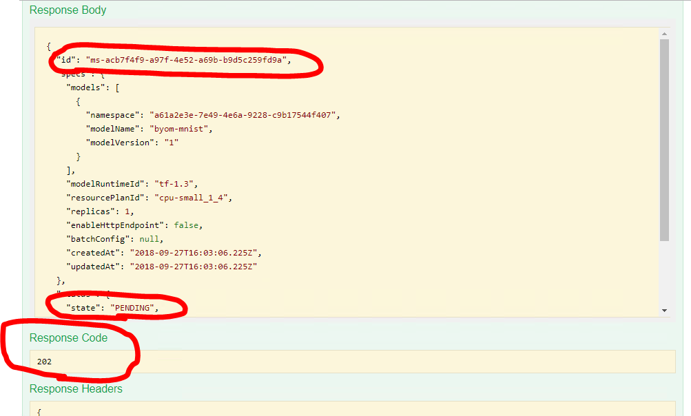

1. Within the same **model-server-controller** API, to the **GET** method *Get a model server* (NB: this is different to the **GET** used previously). Paste the **id** and your access token, then click on the **Try it out!** button to check the deployment status
	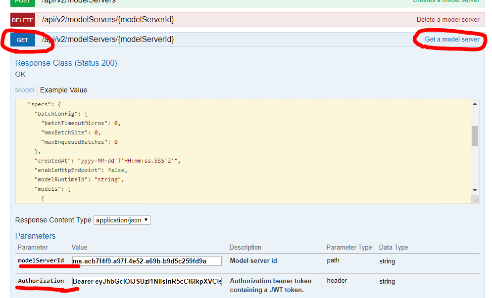

1. Initially you might still get the **PENDING** status: please repeat that step until you get a response with the **deploymentStatus** as **SUCCEEDED**. Please keep this window open as you need some information in the next step  
	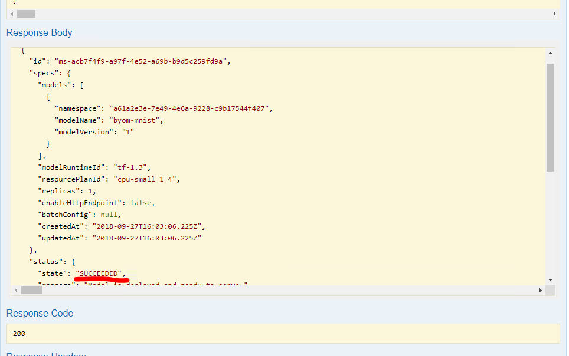


### <a name="test-model"></a> Test your new model
In this section, you will push an application that we have already prepared for you to Cloud Foundry. This app makes inference against your new model available to a consumer.

1. Download the [inference_app.zip](files/inference_app.zip?raw=true) and extract it in a proper folder on your machine  
	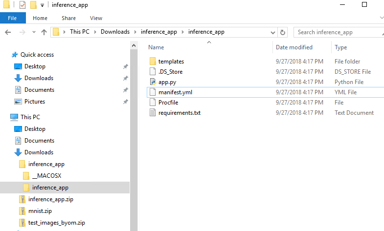

1. Open the *manifest.yml* file with your favorite editor: it should look like this  
	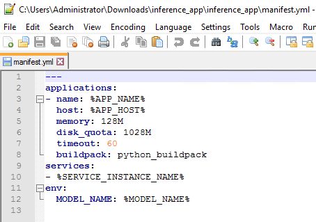

	>NOTE: this is a very "sensible" file in the sense that you need to pay attention to its formatting otherwise pushing the app to Cloud Foundry won't work!

1. Replace the variables in the following way

	| Parameter | Value |
	| --------- | ----- |
	| %APP\_NAME% | the name you want to give to the Cloud Foundry application (i.e. mlapp) |
	| %APP\_HOST% | the unique host name you want to give to the Cloud Foundry application (use your Cloud Foundry trial org and space followed by your app name i.e %org%-%space%-mlapp HINT: use the **cf t** command to see your org and space) |
	| %SERVICE\_INSTANCE\_NAME% | the name of ML Foundation instance you have created in the first exercises (i.e. ml) |
	| %MODEL\_NAME% | the name of the model you have just deployed (i.e. byom-mnist) |
	| memory | set the value to 256M |

	Once done, save the file  

	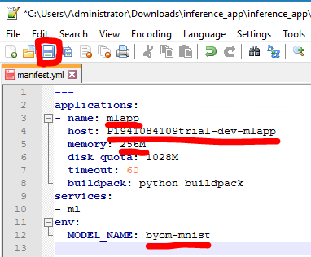

1. Open the *app.py* file with your favorite editor and change **ml-foundation** to **ml-foundation-trial-beta** as we're using the trial landscape rather than a fully productive landscape. Don't forget to save the file!  
	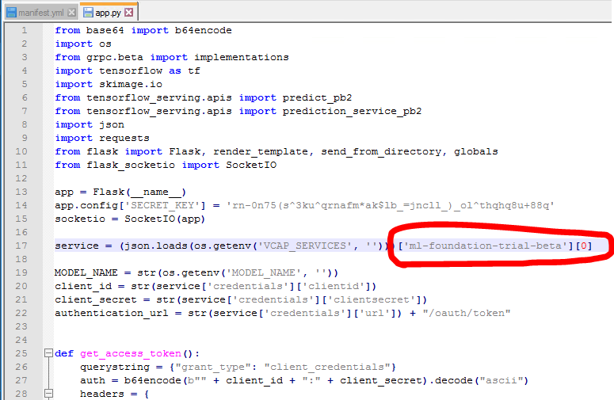

1. In order to deploy your Python inference app to your Cloud Foundry space, open a command prompt and go to the folder where you have extracted the inference app

1. Check that you are in the proper space by entering the commands

	```sh
	cf api
	cf t
	```
	If not, you need to login again with the command

	```sh
	cf login -a <YOUR_API_ENDPOINT>  -u <YOUR_CLOUD_FOUNDRY_USER_EMAIL>
	```
where **\<YOUR\_API\_ENDPOINT\>** is the hostname you can read when you go inside your subaccount on your Cloud Platform trial environment and **\<YOUR\_CLOUD\_FOUNDRY\_USER_EMAIL\>** is the email. When running this command you will be requested to enter the related password  
	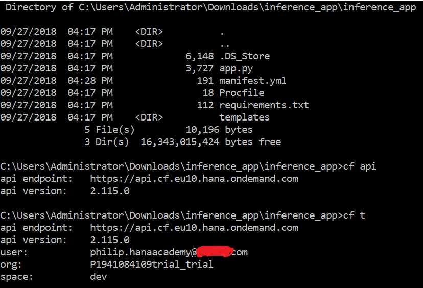

1. Run the following command in this folder. The Python app is pushed to SAP Cloud Foundry according to the information specified in the *manifest.yml* file

	```sh
	cf push
	```   
	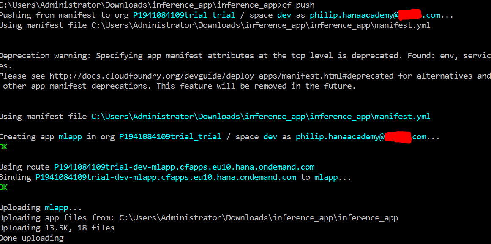

1. At the end of the process (it might take a while), you will get a message like this where the application is shown as running. Copy the URL you get at the end of this process to the clipboard  
	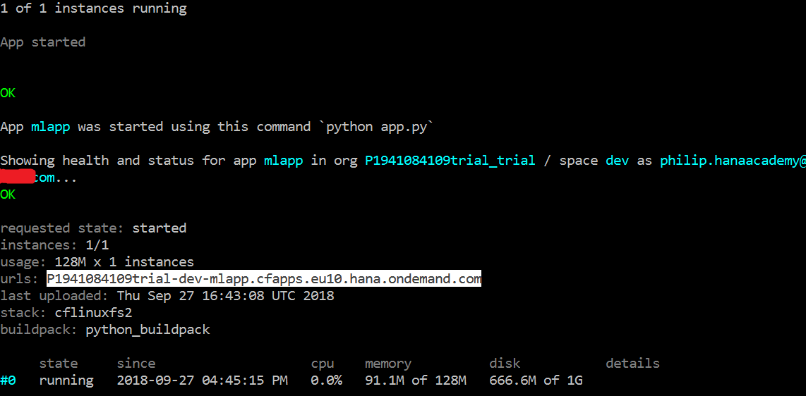

1. Open Chrome, type "https://" and paste the URL you have in the clipboard. Your new application inference is opened. Click on the **Browse...** button  
	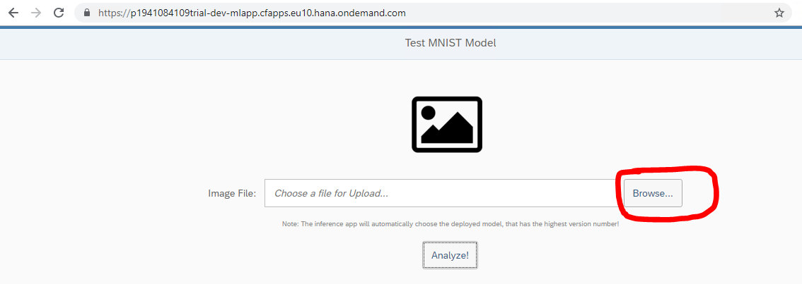

1. Get one of the test images you have already downloaded and extracted previously (i.e. 7.jpg) and click on the **Analyze!** button  
	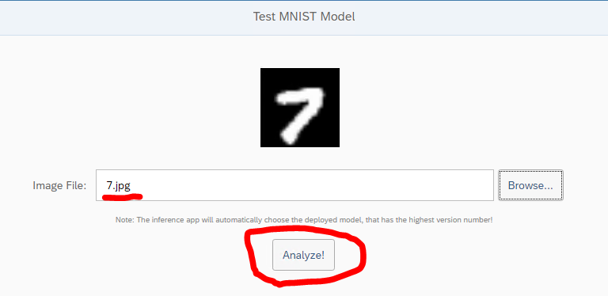

1. The image is analyzed according to your new model and the correct result is displayed  
	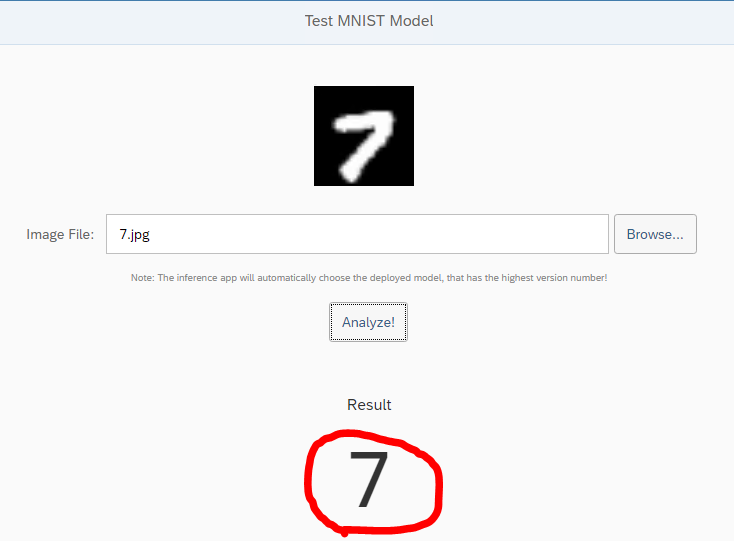


## Summary
You have successfully completed the exercise!

You are now able to:

* Use the service key to retrieve the ML Foundation API endpoints
* Upload your Model using the Model API
* Deploy your Model using the Deployment API
* Check the status of your Model Deployment
* Create and deploy an inference app (written in Python) to your Cloud Foundry space
* Test your newly deployed model
