<table width=100% border=>
<tr><td colspan=2><h1>PREREQUISITES</h1></td></tr>
<tr><td><h3>SAP Partner Workshop</h3></td><td><h1> &nbsp;30 min</h1></td></tr>
</table>

## Description

In this exercise, you’ll go through the basic steps of setting up the development environment required for SAP Leonardo and SAP Cloud Platform workshop.  

## Target group

* Application Developers
* People interested in learning about SAP Leonardo and SAP Cloud Platform  

## Goal

The goal of this exercise is to have your workstation/laptop well prepared in order to attend to the SAP Leonardo and SAP Cloud Platform workshop.  

## Prerequisites

Below are prerequisites required for the exercises in this workshop.  

1. [Bring Your Own Laptop with Admin Access](#laptop)
1. [Remote Desktop Connection](#rdc)
1. [Sign up for SAP Cloud Platform Trial account](#sign-up-trial)
1. [Install Cloud Foundry CLI](#install-cf-cli)
1. [Install MTA Plugin](#install-mta-cli)
1. [Install ML Foundation CLI](#install-ml-cli)
1. [Install Minio Client](#install-minio-client)
1. [Install Chrome Postman application](#postman)
1. [Install Chrome Postman Interceptor extension](#postman-interceptor)  
1. [Install Java JRE](#install-java-jre)
1. [Install Paho Client](#install-paho-client)
1. [Install IoT Services Edge](#install-iot-services-edge)
1. [Install Python](#install-python)
1. [Install OpenSSL](#install-openssl)

##  Bring Your Own Laptop with Admin Access

Please bring the laptop that you have admin access for hands-on exercises.   

##  Remote Desktop Connection

In order to connect with the Virtual Machines we have prepared for you, you need to have the Remote Desktop Connection (RDC) tool installed on your machine. For Windows users, RDC comes already installed, so if you have Windows you don't have to worry about it. If you are Mac user, instead, you can download it for free from the Mac App Store.  
	

## Sign up for SAP Cloud Platform Trial account
You need a SAP Cloud Platform trial account to complete many of the hands-on exercises.

1. Sign up for SAP Cloud Platform trial account from <https://account.hanatrial.ondemand.com/>  
	 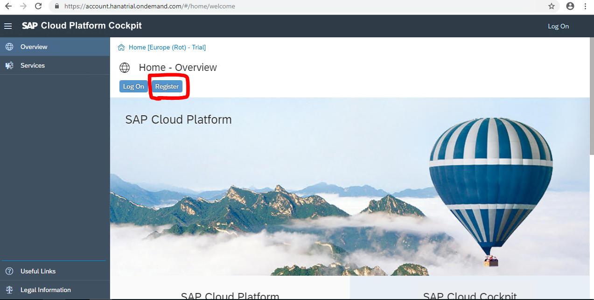

1. After you have logged in you might want to bookmark the main Trial homepage. Then, click on **Neo Trial**  
	 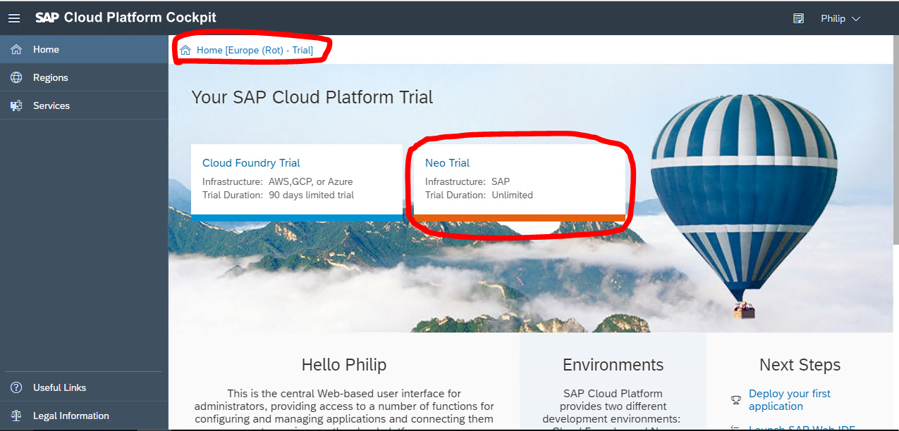

1. This will take you to the **Overview** page of the SAP Cloud Platform Cockpit for Neo  
	 

1. Click on Services. Ensure the service **SAP Web IDE Full-Stack** is enabled. You can search on *full* to find it more easily.
	 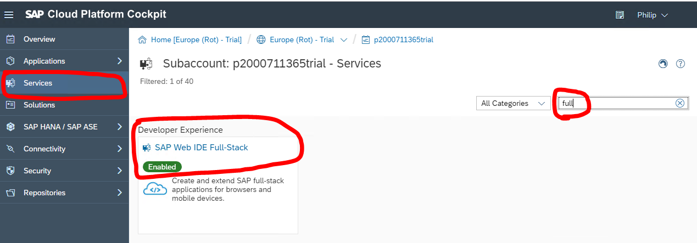

1. Click on the **SAP Web IDE Full-Stack** tile, scroll down and click on *Go to Service*. SAP Web IDE Full-Stack will launch - once finished you might want to bookmark it.
 	 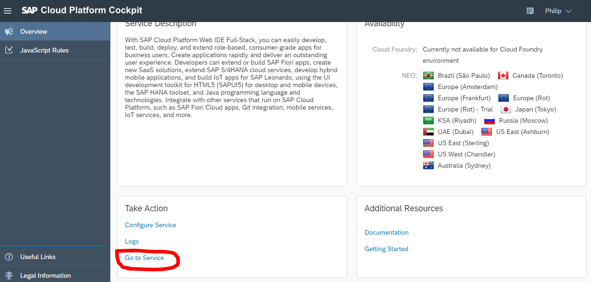

1. From SAP Cloud Platform Cockpit, click on **Home**.
	 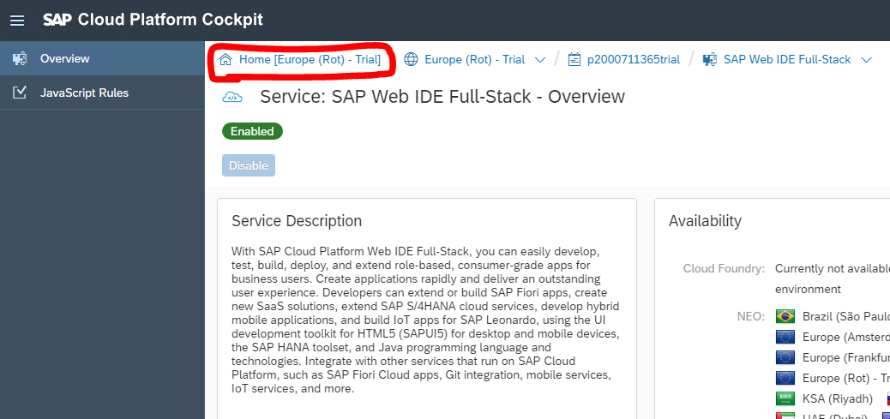

1. Then, click on **Cloud Foundry Trial**.

	 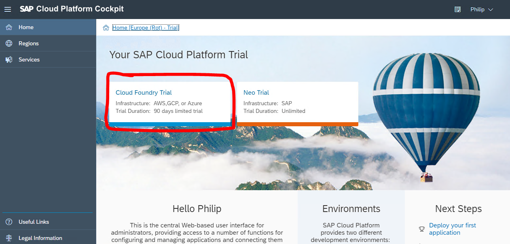

1. Select **Region** *Europe (Frankfurt) AWS* and press **OK**. This is the only region where SAP Leonardo Machine Learning Foundation is  available as a trial. Your Cloud Foundry Trial will be provisioned.  
 	 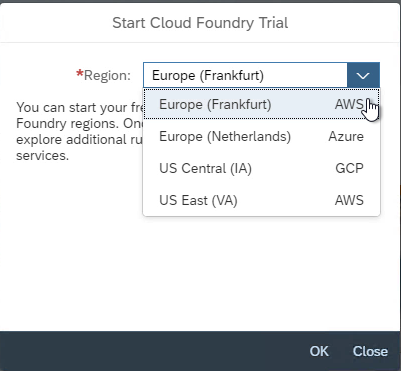

1. Once provisioning is complete click on **Go to Space**.

 	 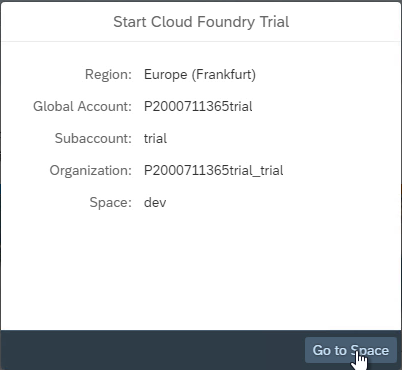

1. Go to the *Subaccounts* page then click on **Entitlements**.
 	 

1. Verify whether two **Application Runtime** MEMORY units have been assigned to the *trial* subaccount.
   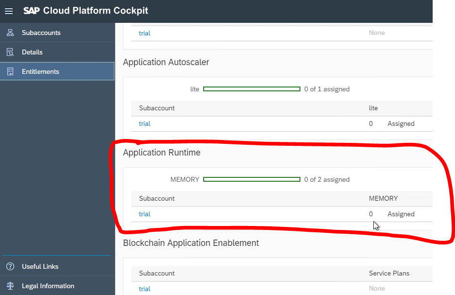

1. If not, scroll up, then click on **Edit**.

   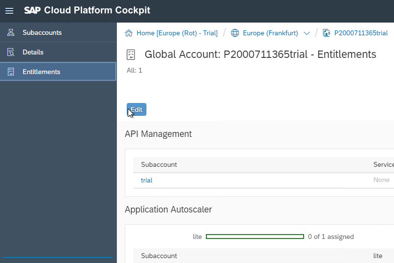

1. Scroll down again and use the *+* to assign two MEMORY units to the *trial* subaccount.
	 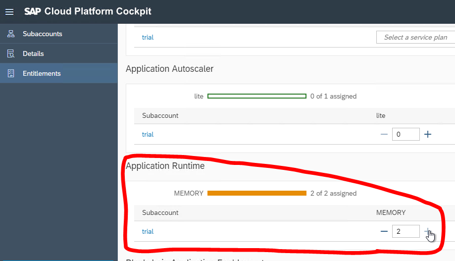

1. Then scroll back up and click on **Save**.
	 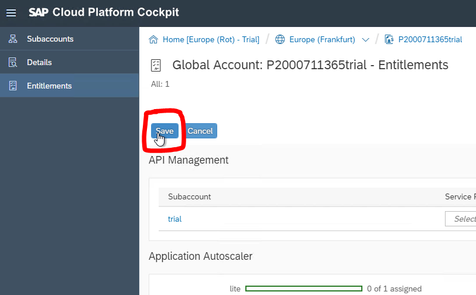

## Install Cloud Foundry CLI
Cloud Foundry CLI is the official command line client for Cloud Foundry. It provides a set of commands for managing your apps.  

1.	Cloud Foundry CLI can be downloaded here <https://github.com/cloudfoundry/cli#downloads>. Just select the installer which matches your Workstation's Operating System
	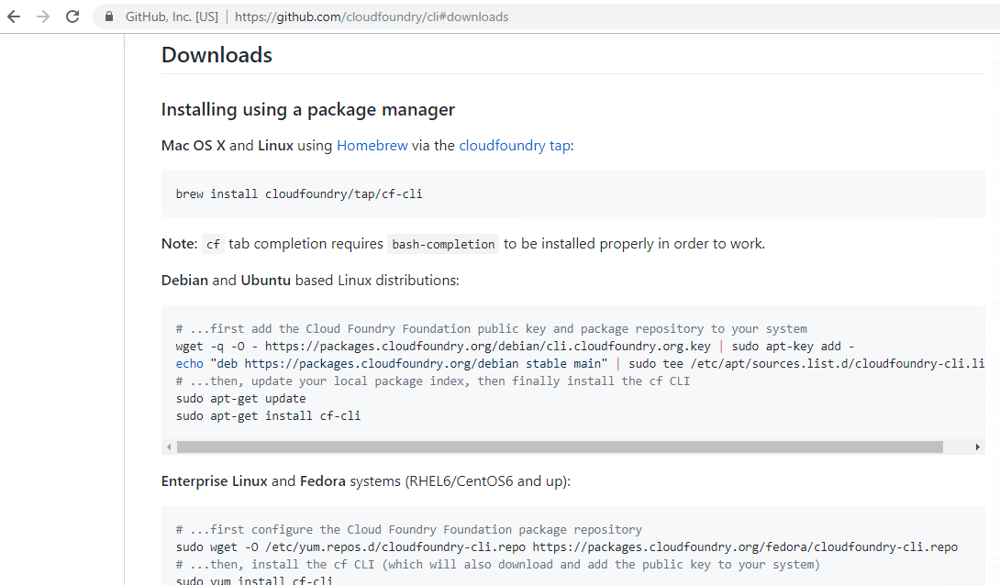

1. Once the file has been downloaded, please extract it then install by double clicking on the extracted file.

## Install MTA Plugin
The SAP Cloud Platform Cloud Foundry Plugins are used to extend the Cloud Foundry CLI with additional commands. The MTA Plugin performs operations on multi-target applications (MTAs) such as deploying, removing, viewing, etc.  

1.	The MTA Plugin can be downloaded here <https://tools.hana.ondemand.com/#cloud>. Scroll down to the **Plugins** section and download MTA plugin which matches your Workstation's Operating System
	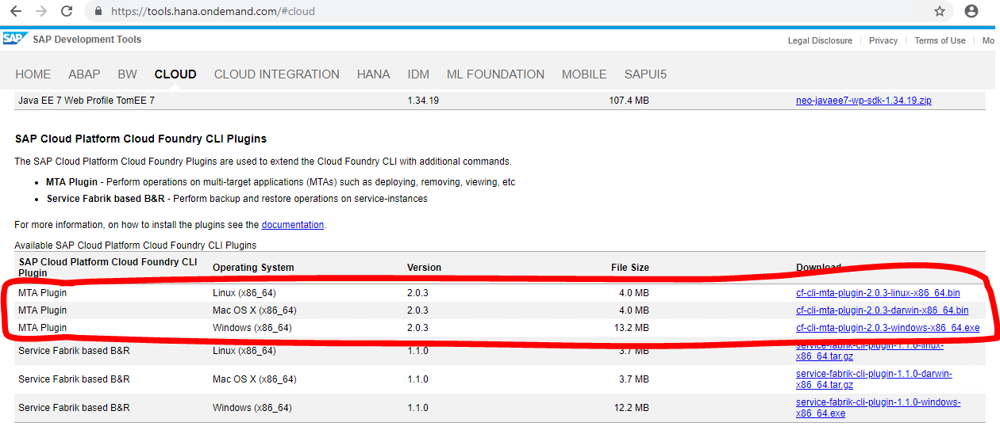

1. Once the file has been downloaded, please install by issuing the following command from a command prompt in the folder where you downloaded the file: **cf install-plugin -f \<downloaded-filename\>** where the name of the downloaded file replaces **\<downloaded-filename\>**.
	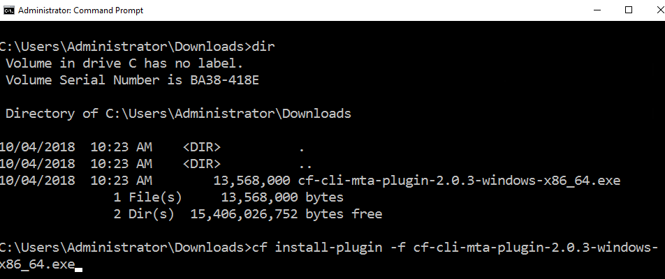

## Install Machine Learning Foundation CLI
SAP Leonardo Machine Learning foundation Command Line Interface (CLI) is a way of interacting with the foundation and using its services, e.g. to simplify data upload for Retraining and Bring your Own Model scenarios as described in the official documentation.

1.	Machine Learning Foundation CLI can be downloaded here <https://tools.hana.ondemand.com/#mlfoundation>. Just select the installer which matches your Workstation's Operating System
	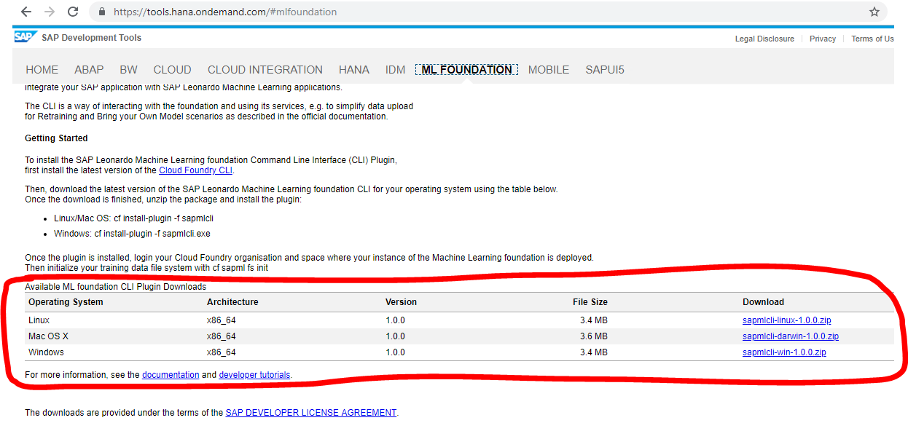

1. Once the file has been downloaded, please extract the file and install by issuing the following command from a command prompt in the folder where you extracted the file: **cf install-plugin -f \<extracted-filename\>** where the name of the extracted file replaces **\<extracted-filename\>**.
	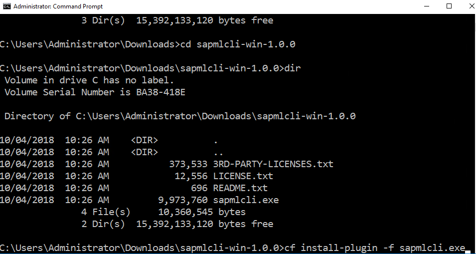

## Install Minio Client

1. Follow instructions on <https://docs.minio.io/docs/minio-client-quickstart-guide.html> to download the client for your operating system.
   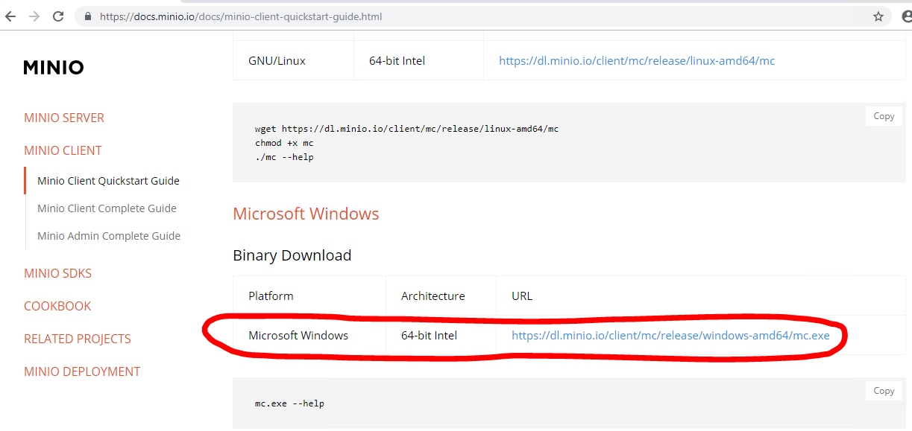

1. Move the downloaded *mc* executable in a folder such as *C:\Student\Minio* and copy this location

   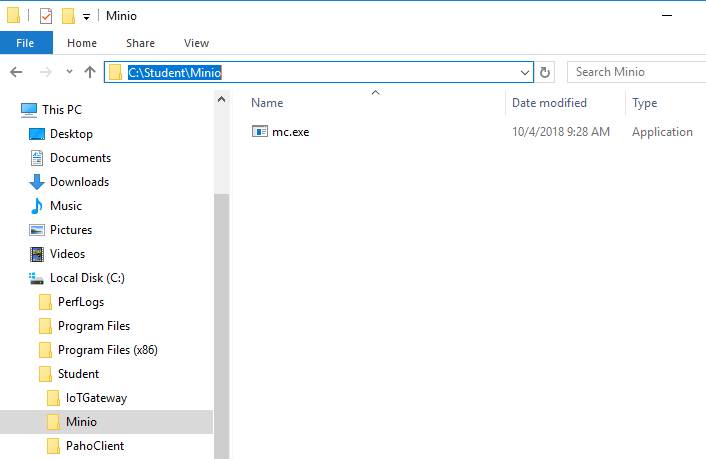

1. To add Minio to your *PATH* on Windows, open **Advanced System Settings**

	 

1.	Click on the **Environment Variables...** button

	 

1.	Edit **PATH** in the System Variables area.

	 

1.	Paste a new value that corresponds to the folder where Minio has been installed.

	 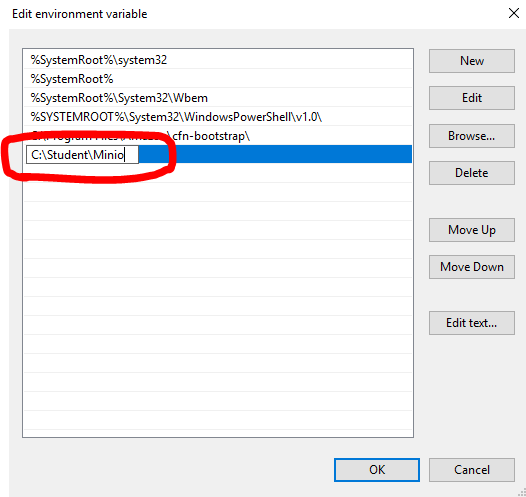

1.  Save all changes.

##  Install Chrome Postman application
For the workshop exercises you need to install the **Postman** application for Chrome. It will allow you to send REST requests to backend systems. Please pay attention that, this kind of application has been deprecated and removed from the Chrome web store, because it has been converted to a stand-alone application. However, for the scope of these exercises you will need to install it as a Chrome app. You can open the following link to install it:

<https://chrome.google.com/webstore/detail/postman/fhbjgbiflinjbdggehcddcbncdddomop>  
	

##  Install Chrome Postman Interceptor extension
Another required tool is the Postman Interceptor extension for Chrome. This can be found on the Chrome Web Store.

1. Navigate to <https://chrome.google.com/webstore/search/postman%20interceptor> and select the **Postman Interceptor** tool  
	

1. Click **Add to Chrome**  
	

## Install Java JRE

1.	Download and install Java JRE from this link <https://www.java.com/en/>  
	

1.	Ensure you download and install the 64 bit version  
	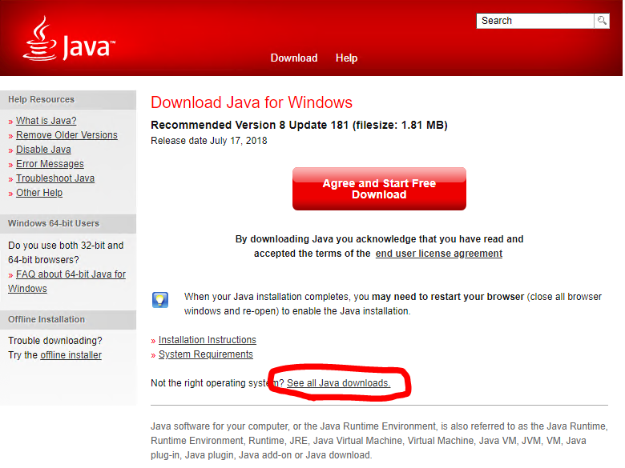
	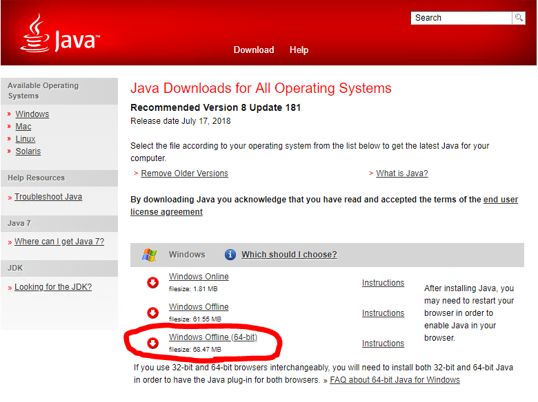

## Install Paho Client

1.	Download the Paho Client from this link <https://help.sap.com/viewer/e9e5e6a2fa144c31b5b5d5c144047dec/Cloud/en-US>. Ensure you download the 64 bit version. Extract the downloaded zip file to *C:\Student\PahoClient*
	

## Install IoT Services Edge 4.0

1. Download **IoT Services Edge 4.0** from the SAP software download center <https://launchpad.support.sap.com/#/softwarecenter>. Search on *iot services edge* to find the Maintenance Software Component more easily. If you don't have access to SWDC don't worry as remote windows desktops with all of prerequisites already installed will be available for use during the workshop.
	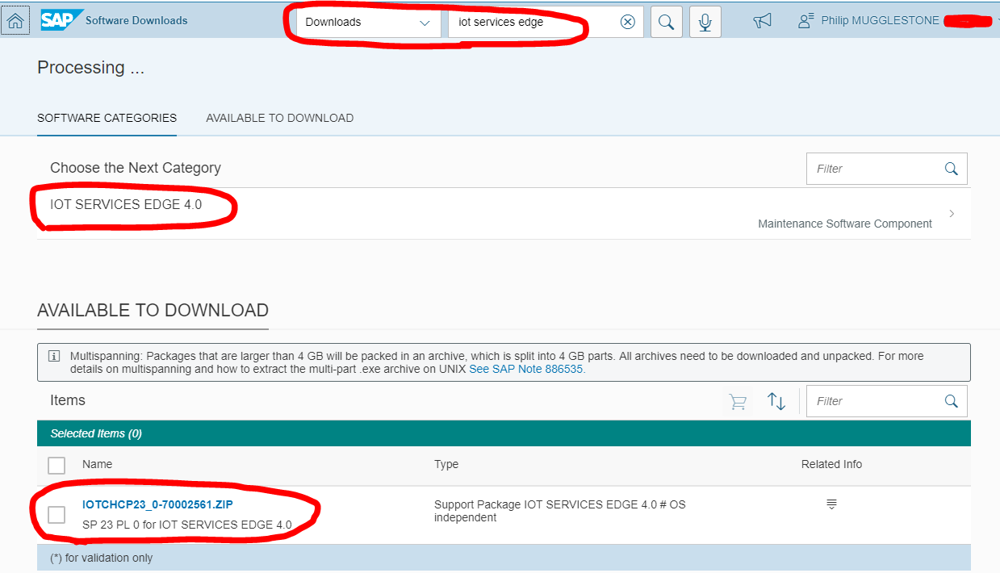

1. Extract the downloaded zip file.

	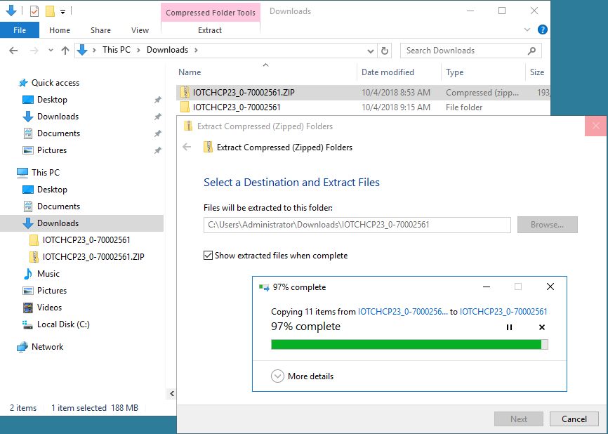

1. Extract the zip file **gateway-4.xx.0.zip** that you'll find in the newly extracted folder to *C:\Student\IotGateway*.
  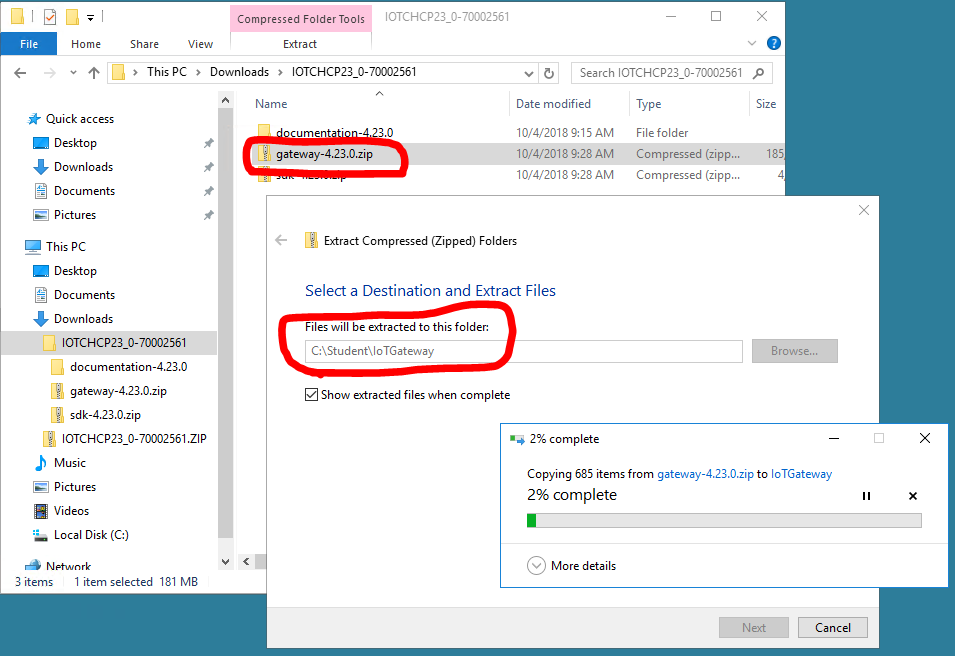

## Install Python

1.	Download and install Python from this link <https://www.python.org>  NB: this is not necessary for Mac users as Python should already be installed.
	

1.	Select downloads and download the windows installer file.
	

1.	Double click on the downloaded file. Be sure to check the **Add Python to PATH** option before commencing the installation.
	

## Install OpenSSL

1.	Download and install OpenSSL from this link <http://gnuwin32.sourceforge.net/packages/openssl.htm>  NB: this is not necessary for Mac users as OpenSSL should already be installed.
	

1.	Download the **Complete package, except sources** then double click on the downloaded file.

	

1.	Note which folder OpenSSL will be installed into (you can copy it).

	

1.	Open **Advanced System Settings** for Windows

	

1.	Click on the **Environment Variables...** button

	

1.	Edit **PATH** in the System Variables area.

	

1.	Paste a new value that corresponds to the folder where OpenSSL has been installed and be sure to add \bin at the end.

	

1.  Save all changes.

## Summary
You have successfully completed the prerequisites installation.
